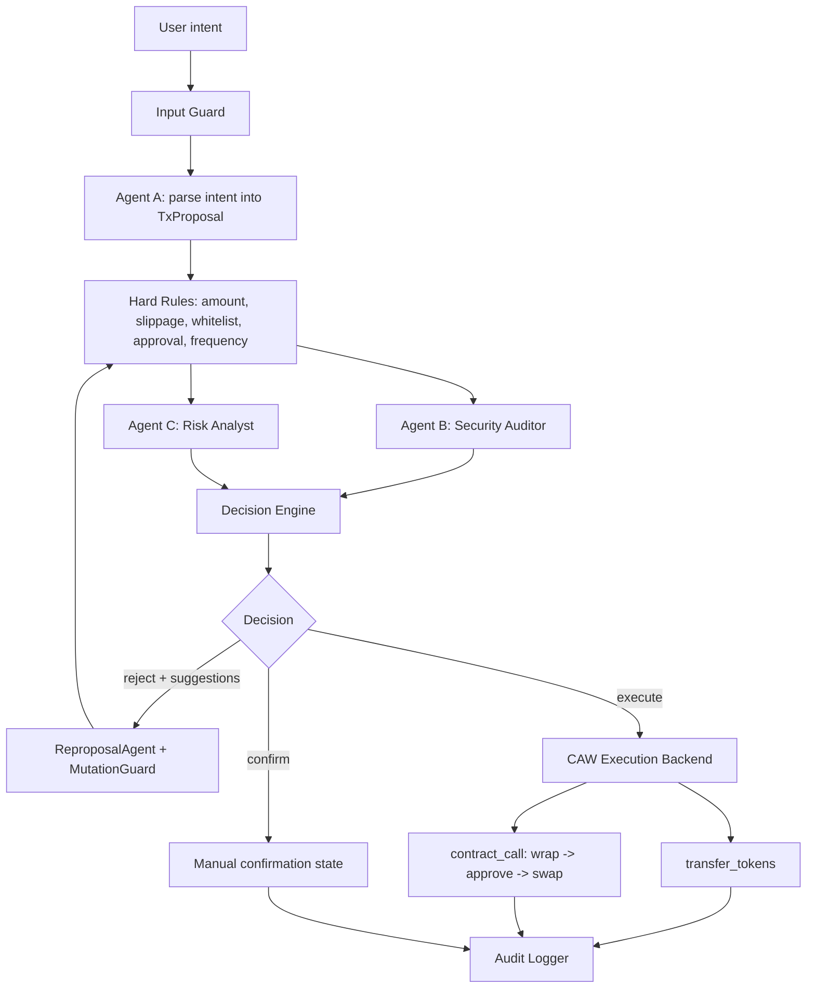

# Sentinel Case Study

## Problem

AI agents can reason about DeFi actions, but wallet execution is irreversible.
If an LLM hallucinates, follows prompt injection, approves unlimited token
spending, or sends funds to the wrong address, the loss is real.

Sentinel explores this question:

> How can an AI agent execute simple on-chain actions while staying inside
> enforceable risk and wallet boundaries?

The project target is not production custody. It is a Sepolia prototype showing
how natural-language intents can become bounded, auditable CAW executions.

## Architecture

Sentinel has two safety layers:

```text
Sentinel layer:
  Input guard, structured proposal, deterministic rules, LLM reviewers,
  bounded retry, and audit.

CAW layer:
  Cobo Agentic Wallet, active Pact, scoped execution, and wallet-level policy
  enforcement.
```



## Execution Flow

1. The user submits a natural-language intent such as `Swap 0.0005 ETH to USDC`
   or `Send 0.001 ETH to 0x...`.
2. `InputGuard` checks length, control characters, prompt-injection patterns,
   and intent/proposal mismatch.
3. Agent A or the deterministic demo parser produces a `TxProposal`.
4. The hard-rule pipeline checks amount, slippage, whitelist, approval, and
   frequency limits.
5. If no hard rule rejects, Agent B performs security review and Agent C
   performs risk analysis.
6. `DecisionEngine` returns `execute`, `confirm`, or `reject`.
7. If a rejection includes actionable suggestions, `AgenticLoop` can retry up
   to two times. `MutationGuard` verifies that the revised proposal actually
   reduces risk.
8. Only an `execute` decision reaches CAW.
9. CAW executes either `transfer_tokens` or `contract_call`.
10. The full decision and execution result is written to the audit log.

## Risk Controls

Sentinel separates deterministic controls from LLM judgment.

Hard rules are code-level checks:

- Amount threshold.
- Slippage threshold.
- Whitelisted contracts.
- Approval risk.
- Frequency limit.

LLM reviewers provide contextual judgment:

- Agent B checks address risk, approval risk, prompt injection, social
  engineering, intent consistency, and action risk.
- Agent C checks amount exposure, slippage, token risk, deadline risk, pattern
  risk, and frequency context.

If an LLM reviewer times out, returns invalid JSON, or misses required fields,
the reviewer fails closed as a high-risk `AgentResult`.

## CAW Integration

Sentinel uses Cobo Agentic Wallet as the execution wallet.

The demo proves two CAW execution paths on Sepolia:

1. `transfer_tokens` for bounded asset transfers.
2. `contract_call` for Uniswap V3 swap execution.

The recorded swap path is:

```text
wrap ETH -> approve WETH to Uniswap router -> exactInputSingle WETH to USDC
```

CAW Pact is the final funds boundary. Sentinel can approve a proposal, but CAW
can still deny execution if the Pact policy is exceeded. That denial is mapped
to final API status `rejected`, with `sentinel_decision = execute` preserved for
explainability.

## Failure Cases

| Failure case | System behavior |
|---|---|
| Prompt injection | `InputGuard` rejects before LLM or CAW execution. |
| Unknown or unsupported intent | Parser returns `unknown`; API rejects and skips execution. |
| Hard-rule violation | Decision becomes `reject`; reviewers and CAW are skipped. |
| LLM invalid JSON | Reviewer returns failed-closed high-risk result; no automatic execution. |
| Reviewer high risk | Decision becomes `reject`; suggestions may trigger bounded retry. |
| Bad reproposal | `MutationGuard` rejects if risk was not actually reduced. |
| No CAW wallet | API returns `no_wallet` and skips execution. |
| Pact not active | API returns `pact_not_active` and skips execution. |
| CAW policy deny | Final result is `rejected`; no SmartAccount fallback. |
| CAW pending or timeout | Result can be `pending`; audit refresh can later update status. |
| CAW execution failure | Final status becomes `failed` with CAW reason preserved. |

## Audit Trail

Audit data is stored in SQLite with JSON fallback. Sensitive keys such as API
keys, credentials, tokens, authorization headers, and private keys are redacted.

Audit records preserve:

- `tx_id`, timestamp, user address, and original intent.
- Final status and decision reason.
- Sentinel decision and Sentinel reason.
- All attempts, proposals, hard-rule results, reviewer results, and suggestions.
- Tool-call evidence and memory anomalies.
- CAW backend status, request id, CAW transaction id, tx hash, wallet address,
  Pact ID, and policy reason.

The frontend uses this audit data to show the Decision Chain and CAW evidence
panel.

## Evaluation

The README records the final evaluation result:

```text
E2E:        31/32 (97%)
Trajectory: 32/32 (100%)
Safety:     20/20 (100%)
Reference:  15/15 (100%)
Fuzz:       10/10 (100%)
Total:      108/109 (99%)
```

The repository also includes backend unit tests, frontend type/lint/build
checks, and a GitHub Actions CI workflow.

## Limitations

- Sepolia testnet only.
- Hackathon prototype, not production custody.
- Demo parser is intentionally narrower than a full production NLU layer.
- CAW real execution depends on CAW availability, Pact status, pairing status,
  and testnet transaction finality.
- LLM reviewers improve contextual judgment but are not formal verification.
- The current system handles single transfer/swap proposals, not full multi-step
  portfolio strategies.

## What I Would Improve In Production

- Formal threat model and external security review.
- Stronger Pact templates for contract calls, selectors, parameters, and token
  approvals.
- Transaction simulation before every CAW submission.
- Post-execution monitoring and webhook-based status updates.
- Auth with wallet signature and JWT.
- Rate limiting and abuse protection.
- PostgreSQL-backed audit storage with migrations.
- Secrets management and encrypted CAW credentials.
- Better retry/pending queue for CAW availability failures.
- More complete strategy support with explicit step-level authorization.
